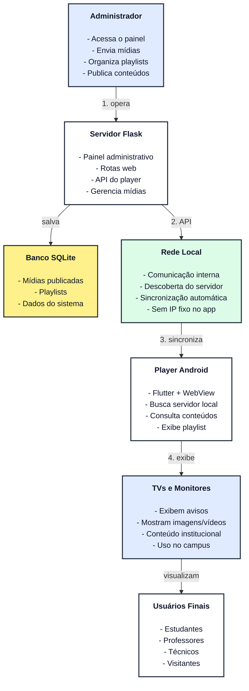

<div align="center">
  
</div>
<br>

# Conecta Campus

Plataforma de Digital Signage para comunicação institucional universitária, criada para exibir editais, avisos, eventos, comunicados e mídias em telas espalhadas pelo campus.

## Objetivo

Centralizar a publicação de informações acadêmicas em um painel web e distribuí-las automaticamente para players instalados em TV Boxes Android, computadores reaproveitados ou outros dispositivos conectados a monitores.

## Principais recursos do MVP atual

- Painel administrativo com login.
- Cadastro de usuários administrativos.
- Upload de imagens e vídeos.
- Biblioteca de mídias.
- Remoção de mídias cadastradas.
- Playlist geral com ordem e duração dos conteúdos.
- Limite de 5 itens na playlist do MVP atual.
- Publicação manual da playlist.
- Player web responsivo para exibição de imagens e vídeos.
- Aplicativo Android em Flutter com WebView.
- Busca automática do servidor Flask na rede local pelo player Android.
- Atualização automática da playlist no player.
- Registro básico de acesso dos players ao servidor.

## Funcionalidades ainda não disponíveis no MVP atual

As funções abaixo fazem parte das próximas evoluções do projeto e não devem ser consideradas como recursos concluídos nesta versão:

- Agendamento de playlists por data e horário.
- Playlists diferentes por tela, setor ou campus.
- Associação individual completa de telas a playlists específicas.
- Relatórios analíticos completos.
- Dashboard avançado de monitoramento.
- QR Codes institucionais dinâmicos.
- Permissões administrativas por setor.
- Uso definitivo com domínio institucional e HTTPS.

## Tecnologias

- Python
- Flask
- SQLite
- HTML, CSS e JavaScript
- Flutter
- webview_flutter

## Estrutura

```text
ProjetoConectaCampus/
├── servidor_flask/
│   ├── app.py
│   ├── wsgi.py
│   ├── requirements.txt
│   ├── static/
│   ├── templates/
│   └── media/
└── android_player_builder/
    ├── main.dart
    └── conecta_campus_player_ok/
```

## Instalação no Windows

```powershell
cd servidor_flask
python -m venv venv
venv\Scripts\activate
pip install -r requirements.txt
python app.py
```

Depois acesse o painel pelo navegador usando o endereço informado no terminal, seguido de `/login`.

## Instalação no Linux

```bash
cd servidor_flask
python3 -m venv venv
source venv/bin/activate
pip install -r requirements.txt
python3 app.py
```

Depois acesse o painel pelo navegador usando o endereço informado no terminal, seguido de `/login`.

## Execução em Produção

O comando `python app.py` inicia o servidor de desenvolvimento embutido do Flask, que **não é recomendado para ambientes de produção** devido a limitações de desempenho e segurança.

Para implantar o sistema de forma definitiva e segura no campus, recomenda-se a seguinte arquitetura:

1. **Servidor WSGI:** Utilize um servidor WSGI robusto (como `gunicorn` no Linux ou `waitress` no Windows) para rodar a aplicação através do arquivo `wsgi.py`.
2. **Proxy Reverso:** Configure um proxy reverso (como Nginx ou Apache) na frente do servidor WSGI. Isso melhora o gerenciamento de requisições, serve arquivos estáticos (mídias) com mais eficiência e permite a configuração de certificados SSL/HTTPS.
3. **VPN (Rede Virtual Privada):** Para evitar problemas de roteamento de IP e manter a segurança do sistema (evitando expor o painel à internet pública), recomenda-se interligar o servidor e as TV Boxes através de uma VPN (como ZeroTier, Tailscale ou Wireguard). Isso cria uma rede local virtual segura, garantindo que a busca automática do player funcione perfeitamente, mesmo entre campi diferentes.

## Primeiro acesso

Usuário inicial:

```text
usuário: admin
senha: admin123
```

Após o primeiro acesso, recomenda-se criar um novo usuário administrativo e alterar as credenciais padrão.

## Player

O player web pode ser acessado no navegador pela rota:

```text
/player/conecta_campus
```

O aplicativo Android foi desenvolvido em Flutter utilizando WebView e funciona como terminal de exibição para TVs e monitores conectados.

Ao iniciar, o player realiza automaticamente a busca do servidor Flask na rede local. Dessa forma, o dispositivo Android procura o servidor disponível na mesma rede e carrega o player sem depender de configuração manual de um endereço fixo no README.

Após localizar o servidor, o player sincroniza automaticamente:

- playlists;
- imagens;
- vídeos;
- conteúdos publicados.

Essa abordagem facilita a implantação em ambientes institucionais, principalmente em redes locais de campus, e reduz a necessidade de configuração técnica nos dispositivos clientes.

## Funcionamento

1. O administrador acessa o painel.
2. Envia imagens ou vídeos.
3. Organiza a playlist geral do MVP.
4. Publica as alterações manualmente.
5. O player localiza o servidor na rede local.
6. O player consulta a API do servidor.
7. A tela exibe os conteúdos automaticamente.

## Sustentabilidade

O projeto incentiva o reaproveitamento de TV Boxes Android, computadores antigos e monitores disponíveis, reduzindo descarte eletrônico e custos de implantação.

## Próximas evoluções

- Playlists por tela, setor ou campus.
- Agendamento por data e horário.
- Relatórios completos de status das telas.
- Integração com QR Codes institucionais.
- Painel com permissões por setor.
- Uso com domínio institucional e HTTPS.

# Autores

* Yuri Duarte Oliveira dos Santos
* Guilherme Henrique dos Santos Valente
* Luis Felype de Souza Macedo
* Alan Cunha Café

**Orientador:** José Vigno Moura Sousa

## Arquitetura Resumida

